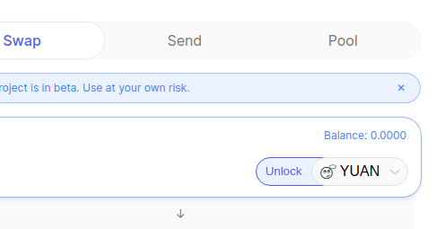
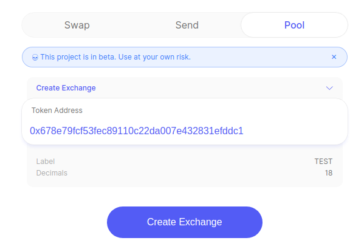
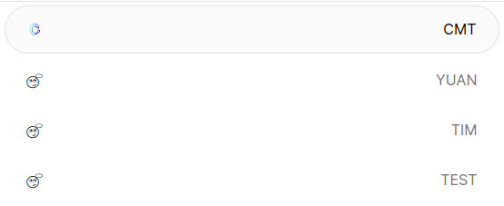
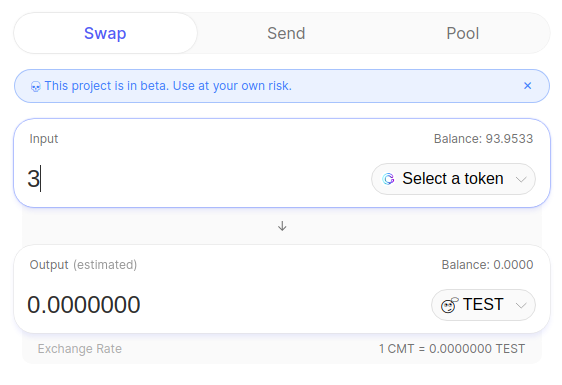

# Uniswap Testing Tutorial

## ERC20 contract checking

It is important that all ERC20 tokens, which are traded inside Uniswap, are fully ERC20 compliant. If tokens are not ERC20 compliant issues can arise. One example of this is the Binance (BNB) token which does not return a Bool as part of the "transfer" function. CyberMiles has an [ERC Checker](https://lity.readthedocs.io/en/latest/erc-contract-checker-guide.html?highlight=checker) which is part of the [Lity compiler](https://lity.readthedocs.io/en/latest/developers-guide.html#developers-guide) it is recommended to verify and thoroughly test any ERC20 tokens which are being added to Uniswap. 

ERC20 compliance and Uniswap compatibility are tricky areas to navigate. Sometimes even though an ERC20 token's smart contract syntax passes compliance some overriden functionality can result in behaviour which is incompatible with the Uniswap frontend. An example of this is the Bancor Smart Token contract. The Bancor Smart Token can not operate with Uniswap because the Unlock does not work consistently. More specifically, the Bancor Smart Token requires that its "approve" function to be called twice in 2 separate transactions - once to change the allowance to 0 and secondly to change it to the new allowance value.

Of course, the Uniswap frontend always passes in a non-zero argument into the "approve" function (in a single step). With this in mind let's start to look at the Uniswap functions. Specifically how they are called from both the Vyper contracts and from the Uniswap frontend UI. We will start with the Unlock (approve) function.

## Testing Uniswap functions

### Unlock

Uniswap performs transactions on behalf of a token contract. The ERC20 standard provides a standard mechanism for this sort of behaviour; namely the approve and allowance functions. Let's take a look at how Uniswap utilizes these standard ERC20 functions both in its smart contracts and in its frontend.

#### Unlock - Vyper contracts

The Vyper contracts can execute the approve and allowance functions via the console.

##### Approve

```javascript
// Approve 
deployedYuanToken.approve(deployedUniswapFactoryContract.getExchange(deployedYuanToken.address), aLargeAmount, {from: tokenOwner})
```

The above command calls the approve function of the deployedYuanToken and passes in the yuanExchangeInstance's address as well as a large number i.e. 1 million. When this transaction succeeds, the tokenHolder will have provided the yuanExchangeInstance with the ability to spend YUAN tokens on the tokenOwner's behalf. This does not spend tokens it just provides approval in principle. A tokenOwner still can not spend tokens if they don't have any i.e. whilst the yuanExchangeInstance has the approval to spend some deployedYuanToken's on behalf of the tokenHolder, MetaMask will never actually allow that transaction to proceed if the tokenOwner does not actually hold any deployedYuanToken's in its account.

##### Allowance

```javascript
// Allowance
web3.fromWei(deployedYuanToken.allowance("0x05849FFc9b899CaFbCda3BBcC22ED93270dCec7c", yuanExchangeInstance.address), 'cmt')
0
```

The above command is an example of an instance where yuanExchangeInstance does not have pre-approval to spend deployedYuanToken's on behalf of the account address called "0x05...3c7c". Notice how the command returns zero (0).

#### Unlock - Frontend

The Unlock button in the Uniswap frontend UI performs the approve task (which we just covered above).


If we go ahead and click Unlock (and approve the transaction in MetaMask using account address "0x05...3c7c") the Uniswap frontend will instantiate a web3 contract object

```javascript
const contract = new web3.eth.Contract(ERC20_ABI, selectedTokenAddress);
```
As well as, call the approve function of the token contract instance.

```javascript
contract.methods.approve
```
The entire code snippet for the Unlock button in the frontend is as follows.

```javascript
<button
        className='currency-input-panel__sub-currency-select'
        onClick={() => {
          const contract = new web3.eth.Contract(ERC20_ABI, selectedTokenAddress);
          const amount = BN(10 ** decimals).multipliedBy(10 ** 8).toFixed(0);
          contract.methods.approve(fromToken[selectedTokenAddress], amount).send({ from: account }, (err, data) => {
              if (!err && data) {
                addPendingTx(data);
                addApprovalTx({ tokenAddress: selectedTokenAddress, txId: data});
              }
            });
        }}
      >Unlock</button>
```
If we now return to the console and run the allowance command once more, we will see that the yuanExchangeInstance now has the approval to spend 100000000 deployedYuanToken's on behalf of the account address "0x05...3c7c".

```javascript
web3.fromWei(deployedYuanToken.allowance("0x05849FFc9b899CaFbCda3BBcC22ED93270dCec7c", yuanExchangeInstance.address), 'cmt')
//100000000
```

### Create Exchange
In this section we are testing Uniswaps "Create Exchange" feature. This can be found in the frontend at the following URL

```javascript
host:3000/create-exchange
```
Before we can create an exchange we need a valid token for the exchange. The following commands are used to create the CRC20 token in the Travis console.

```javascript
crc20Abi = [ { "constant": false, "inputs": [ { "name": "_spender", "type": "address" }, { "name": "_value", "type": "uint256" } ], "name": "approve", "outputs": [ { "name": "", "type": "bool" } ], "payable": false, "stateMutability": "nonpayable", "type": "function" }, { "constant": false, "inputs": [ { "name": "_spender", "type": "address" }, { "name": "_subtractedValue", "type": "uint256" } ], "name": "decreaseApproval", "outputs": [ { "name": "success", "type": "bool" } ], "payable": false, "stateMutability": "nonpayable", "type": "function" }, { "constant": false, "inputs": [ { "name": "_spender", "type": "address" }, { "name": "_addedValue", "type": "uint256" } ], "name": "increaseApproval", "outputs": [ { "name": "success", "type": "bool" } ], "payable": false, "stateMutability": "nonpayable", "type": "function" }, { "constant": false, "inputs": [], "name": "pause", "outputs": [], "payable": false, "stateMutability": "nonpayable", "type": "function" }, { "constant": false, "inputs": [], "name": "renounceOwnership", "outputs": [], "payable": false, "stateMutability": "nonpayable", "type": "function" }, { "constant": false, "inputs": [ { "name": "_contractAddress", "type": "address" }, { "name": "_tokenAmount", "type": "uint256" } ], "name": "setCrowdFunding", "outputs": [], "payable": false, "stateMutability": "nonpayable", "type": "function" }, { "constant": false, "inputs": [ { "name": "_document", "type": "string" } ], "name": "setDocument", "outputs": [], "payable": false, "stateMutability": "nonpayable", "type": "function" }, { "constant": false, "inputs": [ { "name": "_logo", "type": "string" } ], "name": "setLogo", "outputs": [], "payable": false, "stateMutability": "nonpayable", "type": "function" }, { "constant": false, "inputs": [ { "name": "_property", "type": "string" } ], "name": "setProperty", "outputs": [], "payable": false, "stateMutability": "nonpayable", "type": "function" }, { "constant": false, "inputs": [ { "name": "_webSite", "type": "string" } ], "name": "setWebsite", "outputs": [], "payable": false, "stateMutability": "nonpayable", "type": "function" }, { "constant": false, "inputs": [ { "name": "_to", "type": "address" }, { "name": "_value", "type": "uint256" } ], "name": "transfer", "outputs": [ { "name": "", "type": "bool" } ], "payable": false, "stateMutability": "nonpayable", "type": "function" }, { "constant": false, "inputs": [ { "name": "_from", "type": "address" }, { "name": "_to", "type": "address" }, { "name": "_value", "type": "uint256" } ], "name": "transferFrom", "outputs": [ { "name": "", "type": "bool" } ], "payable": false, "stateMutability": "nonpayable", "type": "function" }, { "constant": false, "inputs": [ { "name": "_newOwner", "type": "address" } ], "name": "transferOwnership", "outputs": [], "payable": false, "stateMutability": "nonpayable", "type": "function" }, { "constant": false, "inputs": [], "name": "unpause", "outputs": [], "payable": false, "stateMutability": "nonpayable", "type": "function" }, { "constant": false, "inputs": [ { "name": "_logo", "type": "string" }, { "name": "_webSite", "type": "string" }, { "name": "_links", "type": "string" }, { "name": "_rights", "type": "string" }, { "name": "_description", "type": "string" } ], "name": "updateProfile", "outputs": [], "payable": true, "stateMutability": "payable", "type": "function" }, { "inputs": [ { "name": "_name", "type": "string" }, { "name": "_symbol", "type": "string" }, { "name": "_decimals", "type": "uint8" }, { "name": "_supply", "type": "uint256" }, { "name": "_freezenAmount", "type": "uint256" }, { "name": "_freezenTime", "type": "uint256" } ], "payable": false, "stateMutability": "nonpayable", "type": "constructor" }, { "anonymous": false, "inputs": [ { "indexed": false, "name": "tokenName", "type": "string" }, { "indexed": false, "name": "logo", "type": "string" }, { "indexed": false, "name": "webSite", "type": "string" }, { "indexed": false, "name": "links", "type": "string" }, { "indexed": false, "name": "rights", "type": "string" }, { "indexed": false, "name": "description", "type": "string" } ], "name": "ProfileHistory", "type": "event" }, { "anonymous": false, "inputs": [], "name": "Pause", "type": "event" }, { "anonymous": false, "inputs": [], "name": "Unpause", "type": "event" }, { "anonymous": false, "inputs": [ { "indexed": true, "name": "previousOwner", "type": "address" } ], "name": "OwnershipRenounced", "type": "event" }, { "anonymous": false, "inputs": [ { "indexed": true, "name": "previousOwner", "type": "address" }, { "indexed": true, "name": "newOwner", "type": "address" } ], "name": "OwnershipTransferred", "type": "event" }, { "anonymous": false, "inputs": [ { "indexed": true, "name": "owner", "type": "address" }, { "indexed": true, "name": "spender", "type": "address" }, { "indexed": false, "name": "value", "type": "uint256" } ], "name": "Approval", "type": "event" }, { "anonymous": false, "inputs": [ { "indexed": true, "name": "from", "type": "address" }, { "indexed": true, "name": "to", "type": "address" }, { "indexed": false, "name": "value", "type": "uint256" } ], "name": "Transfer", "type": "event" }, { "constant": true, "inputs": [ { "name": "_owner", "type": "address" }, { "name": "_spender", "type": "address" } ], "name": "allowance", "outputs": [ { "name": "", "type": "uint256" } ], "payable": false, "stateMutability": "view", "type": "function" }, { "constant": true, "inputs": [ { "name": "_owner", "type": "address" } ], "name": "balanceOf", "outputs": [ { "name": "", "type": "uint256" } ], "payable": false, "stateMutability": "view", "type": "function" }, { "constant": true, "inputs": [], "name": "crowdFunding", "outputs": [ { "name": "", "type": "address" } ], "payable": false, "stateMutability": "view", "type": "function" }, { "constant": true, "inputs": [], "name": "decimals", "outputs": [ { "name": "", "type": "uint8" } ], "payable": false, "stateMutability": "view", "type": "function" }, { "constant": true, "inputs": [], "name": "description", "outputs": [ { "name": "", "type": "string" } ], "payable": false, "stateMutability": "view", "type": "function" }, { "constant": true, "inputs": [], "name": "document", "outputs": [ { "name": "", "type": "string" } ], "payable": false, "stateMutability": "view", "type": "function" }, { "constant": true, "inputs": [], "name": "founder", "outputs": [ { "name": "", "type": "address" } ], "payable": false, "stateMutability": "view", "type": "function" }, { "constant": true, "inputs": [], "name": "freezenAmount", "outputs": [ { "name": "", "type": "uint256" } ], "payable": false, "stateMutability": "view", "type": "function" }, { "constant": true, "inputs": [], "name": "freezenTime", "outputs": [ { "name": "", "type": "uint256" } ], "payable": false, "stateMutability": "view", "type": "function" }, { "constant": true, "inputs": [], "name": "INITIAL_SUPPLY", "outputs": [ { "name": "", "type": "uint256" } ], "payable": false, "stateMutability": "view", "type": "function" }, { "constant": true, "inputs": [ { "name": "_founder", "type": "address" }, { "name": "_amount", "type": "uint256" } ], "name": "isFounderFreezen", "outputs": [ { "name": "", "type": "bool" } ], "payable": false, "stateMutability": "view", "type": "function" }, { "constant": true, "inputs": [], "name": "issueDate", "outputs": [ { "name": "", "type": "uint256" } ], "payable": false, "stateMutability": "view", "type": "function" }, { "constant": true, "inputs": [], "name": "links", "outputs": [ { "name": "", "type": "string" } ], "payable": false, "stateMutability": "view", "type": "function" }, { "constant": true, "inputs": [], "name": "logo", "outputs": [ { "name": "", "type": "string" } ], "payable": false, "stateMutability": "view", "type": "function" }, { "constant": true, "inputs": [], "name": "name", "outputs": [ { "name": "", "type": "string" } ], "payable": false, "stateMutability": "view", "type": "function" }, { "constant": true, "inputs": [], "name": "owner", "outputs": [ { "name": "", "type": "address" } ], "payable": false, "stateMutability": "view", "type": "function" }, { "constant": true, "inputs": [], "name": "paused", "outputs": [ { "name": "", "type": "bool" } ], "payable": false, "stateMutability": "view", "type": "function" }, { "constant": true, "inputs": [], "name": "property", "outputs": [ { "name": "", "type": "string" } ], "payable": false, "stateMutability": "view", "type": "function" }, { "constant": true, "inputs": [], "name": "rights", "outputs": [ { "name": "", "type": "string" } ], "payable": false, "stateMutability": "view", "type": "function" }, { "constant": true, "inputs": [], "name": "symbol", "outputs": [ { "name": "", "type": "string" } ], "payable": false, "stateMutability": "view", "type": "function" }, { "constant": true, "inputs": [], "name": "totalSupply", "outputs": [ { "name": "", "type": "uint256" } ], "payable": false, "stateMutability": "view", "type": "function" }, { "constant": true, "inputs": [], "name": "version", "outputs": [ { "name": "", "type": "uint8" } ], "payable": false, "stateMutability": "view", "type": "function" }, { "constant": true, "inputs": [], "name": "website", "outputs": [ { "name": "", "type": "string" } ], "payable": false, "stateMutability": "view", "type": "function" }]
```
```javascript

crc20Bytecode = "0x60806040526000600660146101000a81548160ff0219169083151502179055503480156200002c57600080fd5b50604051620033fb380380620033fb83398101806040528101908080518201929190602001805182019291906020018051906020019092919080519060200190929190805190602001909291908051906020019092919050505033600660006101000a81548173ffffffffffffffffffffffffffffffffffffffff021916908373ffffffffffffffffffffffffffffffffffffffff1602179055508560079080519060200190620000df929190620001cc565b508460089080519060200190620000f8929190620001cc565b5083600960006101000a81548160ff021916908360ff16021790555082600a81905550600a54600481905550600a54600360003373ffffffffffffffffffffffffffffffffffffffff1673ffffffffffffffffffffffffffffffffffffffff1681526020019081526020016000208190555081600081905550806001819055504260108190555033601460006101000a81548173ffffffffffffffffffffffffffffffffffffffff021916908373ffffffffffffffffffffffffffffffffffffffff1602179055505050505050506200027b565b82805460018160011615610100020d166002900490600052602060002090601f016020900481019282601f106200020f57805160ff191683800117855562000240565b8280016001018555821562000240579182015b828111156200023f57825182559160200191906001019062000222565b5b5090506200024f919062000253565b5090565b6200027891905b80821115620002745760008160009055506001016200025a565b5090565b90565b613170806200028b6000396000f3006080604052600436106101d8576000357c0100000000000000000000000000000000000000000000000000000000900463ffffffff16806306fdde03146101dd578063095ea7b31461026d578063176fd3f0146102d257806318160ddd146103625780631f4339d81461038d57806323b872dd1461041d5780632fe31962146104a25780632ff2e9dc1461050b578063313ce567146105365780633f4ba83a146105675780634d853ee51461057e5780634f22172f146105d5578063537c07861461063e57806354fd4d50146106a75780635c975abb146106d8578063661884631461070757806368c62c9c1461076c57806370a08231146107fc578063715018a6146108535780637284e4161461086a5780638456cb59146108fa5780638d1343e0146109115780638da5cb5b1461093c57806395d89b4114610993578063980e8db614610a23578063a9059cbb14610ab3578063b043e03214610b18578063b6acabc114610c8c578063b801ce8914610ce3578063beb0a41614610d0e578063d416212414610d9e578063d73dd62314610e03578063d9ce133314610e68578063dd62ed3e14610eb5578063e76ef42314610f2c578063f2fde38b14610f57578063f87f44b914610f9a578063fb7f21eb14611003575b600080fd5b3480156101e957600080fd5b506101f2611093565b6040518080602001828103825283818151815260200191508051906020019080838360005b83811015610232578082015181840152602081019050610217565b50505050905090810190601f16801561025f5780820d805160018360200d6101000a0d1916815260200191505b509250505060405180910390f35b34801561027957600080fd5b506102b8600480360381019080803573ffffffffffffffffffffffffffffffffffffffff16906020019092919080359060200190929190505050611131565b604051808215151515815260200191505060405180910390f35b3480156102de57600080fd5b506102e7611161565b6040518080602001828103825283818151815260200191508051906020019080838360005b8381101561032757808201518184015260208101905061030c565b50505050905090810190601f1680156103545780820d805160018360200d6101000a0d1916815260200191505b509250505060405180910390f35b34801561036e57600080fd5b506103776111ff565b6040518082815260200191505060405180910390f35b34801561039957600080fd5b506103a2611209565b6040518080602001828103825283818151815260200191508051906020019080838360005b838110156103e25780820151818401526020810190506103c7565b50505050905090810190601f16801561040f5780820d805160018360200d6101000a0d1916815260200191505b509250505060405180910390f35b34801561042957600080fd5b50610488600480360381019080803573ffffffffffffffffffffffffffffffffffffffff169060200190929190803573ffffffffffffffffffffffffffffffffffffffff169060200190929190803590602001909291905050506112a7565b604051808215151515815260200191505060405180910390f35b3480156104ae57600080fd5b50610509600480360381019080803590602001908201803590602001908080601f0160208091040260200160405190810160405280939291908181526020018383808284378201915050505050509192919290505050611354565b005b34801561051757600080fd5b506105206113ca565b6040518082815260200191505060405180910390f35b34801561054257600080fd5b5061054b6113d0565b604051808260ff1660ff16815260200191505060405180910390f35b34801561057357600080fd5b5061057c6113e3565b005b34801561058a57600080fd5b506105936114a3565b604051808273ffffffffffffffffffffffffffffffffffffffff1673ffffffffffffffffffffffffffffffffffffffff16815260200191505060405180910390f35b3480156105e157600080fd5b5061063c600480360381019080803590602001908201803590602001908080601f01602080910402602001604051908101604052809392919081815260200183838082843782019150505050505091929192905050506114c9565b005b34801561064a57600080fd5b506106a5600480360381019080803590602001908201803590602001908080601f016020809104026020016040519081016040528093929190818152602001838380828437820191505050505050919291929050505061153f565b005b3480156106b357600080fd5b506106bc6115b5565b604051808260ff1660ff16815260200191505060405180910390f35b3480156106e457600080fd5b506106ed6115ba565b604051808215151515815260200191505060405180910390f35b34801561071357600080fd5b50610752600480360381019080803573ffffffffffffffffffffffffffffffffffffffff169060200190929190803590602001909291905050506115cd565b604051808215151515815260200191505060405180910390f35b34801561077857600080fd5b506107816115fd565b6040518080602001828103825283818151815260200191508051906020019080838360005b838110156107c15780820151818401526020810190506107a6565b50505050905090810190601f1680156107ee5780820d805160018360200d6101000a0d1916815260200191505b509250505060405180910390f35b34801561080857600080fd5b5061083d600480360381019080803573ffffffffffffffffffffffffffffffffffffffff16906020019092919050505061169b565b6040518082815260200191505060405180910390f35b34801561085f57600080fd5b506108686116e4565b005b34801561087657600080fd5b5061087f6117e9565b6040518080602001828103825283818151815260200191508051906020019080838360005b838110156108bf5780820151818401526020810190506108a4565b50505050905090810190601f1680156108ec5780820d805160018360200d6101000a0d1916815260200191505b509250505060405180910390f35b34801561090657600080fd5b5061090f611887565b005b34801561091d57600080fd5b50610926611948565b6040518082815260200191505060405180910390f35b34801561094857600080fd5b5061095161194e565b604051808273ffffffffffffffffffffffffffffffffffffffff1673ffffffffffffffffffffffffffffffffffffffff16815260200191505060405180910390f35b34801561099f57600080fd5b506109a8611974565b6040518080602001828103825283818151815260200191508051906020019080838360005b838110156109e85780820151818401526020810190506109cd565b50505050905090810190601f168015610a155780820d805160018360200d6101000a0d1916815260200191505b509250505060405180910390f35b348015610a2f57600080fd5b50610a38611a12565b6040518080602001828103825283818151815260200191508051906020019080838360005b83811015610a78578082015181840152602081019050610a5d565b50505050905090810190601f168015610aa55780820d805160018360200d6101000a0d1916815260200191505b509250505060405180910390f35b348015610abf57600080fd5b50610afe600480360381019080803573ffffffffffffffffffffffffffffffffffffffff16906020019092919080359060200190929190505050611ab0565b604051808215151515815260200191505060405180910390f35b610c8a600480360381019080803590602001908201803590602001908080601f0160208091040260200160405190810160405280939291908181526020018383808284378201915050505050509192919290803590602001908201803590602001908080601f0160208091040260200160405190810160405280939291908181526020018383808284378201915050505050509192919290803590602001908201803590602001908080601f0160208091040260200160405190810160405280939291908181526020018383808284378201915050505050509192919290803590602001908201803590602001908080601f0160208091040260200160405190810160405280939291908181526020018383808284378201915050505050509192919290803590602001908201803590602001908080601f0160208091040260200160405190810160405280939291908181526020018383808284378201915050505050509192919290505050611b5b565b005b348015610c9857600080fd5b50610ca1611fa2565b604051808273ffffffffffffffffffffffffffffffffffffffff1673ffffffffffffffffffffffffffffffffffffffff16815260200191505060405180910390f35b348015610cef57600080fd5b50610cf8611fc8565b6040518082815260200191505060405180910390f35b348015610d1a57600080fd5b50610d23611fce565b6040518080602001828103825283818151815260200191508051906020019080838360005b83811015610d63578082015181840152602081019050610d48565b50505050905090810190601f168015610d905780820d805160018360200d6101000a0d1916815260200191505b509250505060405180910390f35b348015610daa57600080fd5b50610de9600480360381019080803573ffffffffffffffffffffffffffffffffffffffff1690602001909291908035906020019092919050505061206c565b604051808215151515815260200191505060405180910390f35b348015610e0f57600080fd5b50610e4e600480360381019080803573ffffffffffffffffffffffffffffffffffffffff169060200190929190803590602001909291905050506120da565b604051808215151515815260200191505060405180910390f35b348015610e7457600080fd5b50610eb3600480360381019080803573ffffffffffffffffffffffffffffffffffffffff1690602001909291908035906020019092919050505061210a565b005b348015610ec157600080fd5b50610f16600480360381019080803573ffffffffffffffffffffffffffffffffffffffff169060200190929190803573ffffffffffffffffffffffffffffffffffffffff1690602001909291905050506121b6565b6040518082815260200191505060405180910390f35b348015610f3857600080fd5b50610f4161223d565b6040518082815260200191505060405180910390f35b348015610f6357600080fd5b50610f98600480360381019080803573ffffffffffffffffffffffffffffffffffffffff169060200190929190505050612243565b005b348015610fa657600080fd5b50611001600480360381019080803590602001908201803590602001908080601f01602080910402602001604051908101604052809392919081815260200183838082843782019150505050505091929192905050506122ab565b005b34801561100f57600080fd5b50611018612321565b6040518080602001828103825283818151815260200191508051906020019080838360005b8381101561105857808201518184015260208101905061103d565b50505050905090810190601f1680156110855780820d805160018360200d6101000a0d1916815260200191505b509250505060405180910390f35b6007805460018160011615610100020d166002900480601f016020809104026020016040519081016040528092919081815260200182805460018160011615610100020d166002900480156111295780601f106110fe57610100808354040283529160200191611129565b820191906000526020600020905b81548152906001019060200180831161110c5782900d601f168201915b505050505081565b6000600660149054906101000a900460ff1615151561114f57600080fd5b61115983836123bf565b905092915050565b6012805460018160011615610100020d166002900480601f016020809104026020016040519081016040528092919081815260200182805460018160011615610100020d166002900480156111f75780601f106111cc576101008083540402835291602001916111f7565b820191906000526020600020905b8154815290600101906020018083116111da5782900d601f168201915b505050505081565b6000600454905090565b6013805460018160011615610100020d166002900480601f016020809104026020016040519081016040528092919081815260200182805460018160011615610100020d1660029004801561129f5780601f106112745761010080835404028352916020019161129f565b820191906000526020600020905b8154815290600101906020018083116112825782900d601f168201915b505050505081565b6000600660149054906101000a900460ff161515156112c557600080fd5b600660009054906101000a900473ffffffffffffffffffffffffffffffffffffffff1673ffffffffffffffffffffffffffffffffffffffff168473ffffffffffffffffffffffffffffffffffffffff16141561134057600054826113288661169b565b03101561133f5760015442101561133e57600080fd5b5b5b61134b8484846124b1565b90509392505050565b600660009054906101000a900473ffffffffffffffffffffffffffffffffffffffff1673ffffffffffffffffffffffffffffffffffffffff163373ffffffffffffffffffffffffffffffffffffffff161415156113b057600080fd5b80600d90805190602001906113c692919061309f565b5050565b600a5481565b600960009054906101000a900460ff1681565b600660009054906101000a900473ffffffffffffffffffffffffffffffffffffffff1673ffffffffffffffffffffffffffffffffffffffff163373ffffffffffffffffffffffffffffffffffffffff1614151561143f57600080fd5b600660149054906101000a900460ff16151561145a57600080fd5b6000600660146101000a81548160ff0219169083151502179055507f7805862f689e2f13df9f062ff482ad3ad112aca9e0847911ed832e158c525b3360405160405180910390a1565b601460009054906101000a900473ffffffffffffffffffffffffffffffffffffffff1681565b600660009054906101000a900473ffffffffffffffffffffffffffffffffffffffff1673ffffffffffffffffffffffffffffffffffffffff163373ffffffffffffffffffffffffffffffffffffffff1614151561152557600080fd5b806012908051906020019061153b92919061309f565b5050565b600660009054906101000a900473ffffffffffffffffffffffffffffffffffffffff1673ffffffffffffffffffffffffffffffffffffffff163373ffffffffffffffffffffffffffffffffffffffff1614151561159b57600080fd5b80601390805190602001906115b192919061309f565b5050565b600281565b600660149054906101000a900460ff1681565b6000600660149054906101000a900460ff161515156115eb57600080fd5b6115f58383612885565b905092915050565b600c805460018160011615610100020d166002900480601f016020809104026020016040519081016040528092919081815260200182805460018160011615610100020d166002900480156116935780601f1061166857610100808354040283529160200191611693565b820191906000526020600020905b8154815290600101906020018083116116765782900d601f168201915b505050505081565b6000600360008373ffffffffffffffffffffffffffffffffffffffff1673ffffffffffffffffffffffffffffffffffffffff168152602001908152602001600020549050919050565b600660009054906101000a900473ffffffffffffffffffffffffffffffffffffffff1673ffffffffffffffffffffffffffffffffffffffff163373ffffffffffffffffffffffffffffffffffffffff1614151561174057600080fd5b600660009054906101000a900473ffffffffffffffffffffffffffffffffffffffff1673ffffffffffffffffffffffffffffffffffffffff167ff8df31144d9c2f0f6b59d69b8b98abd5459d07f2742c4df920b25aae33c6482060405160405180910390a26000600660006101000a81548173ffffffffffffffffffffffffffffffffffffffff021916908373ffffffffffffffffffffffffffffffffffffffff160217905550565b600f805460018160011615610100020d166002900480601f016020809104026020016040519081016040528092919081815260200182805460018160011615610100020d1660029004801561187f5780601f106118545761010080835404028352916020019161187f565b820191906000526020600020905b8154815290600101906020018083116118625782900d601f168201915b505050505081565b600660009054906101000a900473ffffffffffffffffffffffffffffffffffffffff1673ffffffffffffffffffffffffffffffffffffffff163373ffffffffffffffffffffffffffffffffffffffff161415156118e357600080fd5b600660149054906101000a900460ff161515156118ff57600080fd5b6001600660146101000a81548160ff0219169083151502179055507f6985a02210a168e66602d3235cb6db0e70f92b3ba4d376a33c0f3d9434bff62560405160405180910390a1565b60105481565b600660009054906101000a900473ffffffffffffffffffffffffffffffffffffffff1681565b6008805460018160011615610100020d166002900480601f016020809104026020016040519081016040528092919081815260200182805460018160011615610100020d16600290048015611a0a5780601f106119df57610100808354040283529160200191611a0a565b820191906000526020600020905b8154815290600101906020018083116119ed5782900d601f168201915b505050505081565b600e805460018160011615610100020d166002900480601f016020809104026020016040519081016040528092919081815260200182805460018160011615610100020d16600290048015611aa85780601f10611a7d57610100808354040283529160200191611aa8565b820191906000526020600020905b815481529060010190602001808311611a8b5782900d601f168201915b505050505081565b6000600660149054906101000a900460ff16151515611ace57600080fd5b600660009054906101000a900473ffffffffffffffffffffffffffffffffffffffff1673ffffffffffffffffffffffffffffffffffffffff163373ffffffffffffffffffffffffffffffffffffffff161415611b495760005482611b313361169b565b031015611b4857600154421015611b4757600080fd5b5b5b611b538383612b17565b905092915050565b600660009054906101000a900473ffffffffffffffffffffffffffffffffffffffff1673ffffffffffffffffffffffffffffffffffffffff163373ffffffffffffffffffffffffffffffffffffffff16141515611bb757600080fd5b7fb93f38a074933492c29876bcadae0091db8974a77ddc7e34ac7a88f0d53205b86007600d600b600c600e600f6040518080602001806020018060200180602001806020018060200187810387528d81815460018160011615610100020d166002900481526020019150805460018160011615610100020d16600290048015611c815780601f10611c5657610100808354040283529160200191611c81565b820191906000526020600020905b815481529060010190602001808311611c645782900d601f168201915b505087810386528c81815460018160011615610100020d166002900481526020019150805460018160011615610100020d16600290048015611d045780601f10611cd957610100808354040283529160200191611d04565b820191906000526020600020905b815481529060010190602001808311611ce75782900d601f168201915b505087810385528b81815460018160011615610100020d166002900481526020019150805460018160011615610100020d16600290048015611d875780601f10611d5c57610100808354040283529160200191611d87565b820191906000526020600020905b815481529060010190602001808311611d6a5782900d601f168201915b505087810384528a81815460018160011615610100020d166002900481526020019150805460018160011615610100020d16600290048015611e0a5780601f10611ddf57610100808354040283529160200191611e0a565b820191906000526020600020905b815481529060010190602001808311611ded5782900d601f168201915b505087810383528981815460018160011615610100020d166002900481526020019150805460018160011615610100020d16600290048015611e8d5780601f10611e6257610100808354040283529160200191611e8d565b820191906000526020600020905b815481529060010190602001808311611e705782900d601f168201915b505087810382528881815460018160011615610100020d166002900481526020019150805460018160011615610100020d16600290048015611f105780601f10611ee557610100808354040283529160200191611f10565b820191906000526020600020905b815481529060010190602001808311611ef35782900d601f168201915b50509c5050505050505050505050505060405180910390a184600d9080519060200190611f3e92919061309f565b5083600b9080519060200190611f5592919061309f565b5082600c9080519060200190611f6c92919061309f565b5081600e9080519060200190611f8392919061309f565b5080600f9080519060200190611f9a92919061309f565b505050505050565b601160009054906101000a900473ffffffffffffffffffffffffffffffffffffffff1681565b60005481565b600b805460018160011615610100020d166002900480601f016020809104026020016040519081016040528092919081815260200182805460018160011615610100020d166002900480156120645780601f1061203957610100808354040283529160200191612064565b820191906000526020600020905b8154815290600101906020018083116120475782900d601f168201915b505050505081565b60003373ffffffffffffffffffffffffffffffffffffffff168373ffffffffffffffffffffffffffffffffffffffff161480156120aa575060015442105b80156120c15750600054826120be8561169b565b03105b156120cf57600190506120d4565b600090505b92915050565b6000600660149054906101000a900460ff161515156120f857600080fd5b6121028383612d72565b905092915050565b600660009054906101000a900473ffffffffffffffffffffffffffffffffffffffff1673ffffffffffffffffffffffffffffffffffffffff163373ffffffffffffffffffffffffffffffffffffffff1614151561216657600080fd5b81601160006101000a81548173ffffffffffffffffffffffffffffffffffffffff021916908373ffffffffffffffffffffffffffffffffffffffff1602179055506121b18282611ab0565b505050565b6000600560008473ffffffffffffffffffffffffffffffffffffffff1673ffffffffffffffffffffffffffffffffffffffff16815260200190815260200160002060008373ffffffffffffffffffffffffffffffffffffffff1673ffffffffffffffffffffffffffffffffffffffff16815260200190815260200160002054905092915050565b60015481565b600660009054906101000a900473ffffffffffffffffffffffffffffffffffffffff1673ffffffffffffffffffffffffffffffffffffffff163373ffffffffffffffffffffffffffffffffffffffff1614151561229f57600080fd5b6122a881612f6e565b50565b600660009054906101000a900473ffffffffffffffffffffffffffffffffffffffff1673ffffffffffffffffffffffffffffffffffffffff163373ffffffffffffffffffffffffffffffffffffffff1614151561230757600080fd5b80600b908051906020019061231d92919061309f565b5050565b600d805460018160011615610100020d166002900480601f016020809104026020016040519081016040528092919081815260200182805460018160011615610100020d166002900480156123b75780601f1061238c576101008083540402835291602001916123b7565b820191906000526020600020905b81548152906001019060200180831161239a5782900d601f168201915b505050505081565b600081600560003373ffffffffffffffffffffffffffffffffffffffff1673ffffffffffffffffffffffffffffffffffffffff16815260200190815260200160002060008573ffffffffffffffffffffffffffffffffffffffff1673ffffffffffffffffffffffffffffffffffffffff168152602001908152602001600020819055508273ffffffffffffffffffffffffffffffffffffffff163373ffffffffffffffffffffffffffffffffffffffff167f8c5be1e5ebec7d5bd14f71427d1e84f3dd0314c0f7b2291e5b200ac8c7c3b925846040518082815260200191505060405180910390a36001905092915050565b60006124bd848361206c565b156124c757600080fd5b600360008573ffffffffffffffffffffffffffffffffffffffff1673ffffffffffffffffffffffffffffffffffffffff16815260200190815260200160002054821115151561251557600080fd5b600560008573ffffffffffffffffffffffffffffffffffffffff1673ffffffffffffffffffffffffffffffffffffffff16815260200190815260200160002060003373ffffffffffffffffffffffffffffffffffffffff1673ffffffffffffffffffffffffffffffffffffffff1681526020019081526020016000205482111515156125a057600080fd5b600073ffffffffffffffffffffffffffffffffffffffff168373ffffffffffffffffffffffffffffffffffffffff16141515156125dc57600080fd5b61262e82600360008773ffffffffffffffffffffffffffffffffffffffff1673ffffffffffffffffffffffffffffffffffffffff1681526020019081526020016000205461306a90919063ffffffff16565b600360008673ffffffffffffffffffffffffffffffffffffffff1673ffffffffffffffffffffffffffffffffffffffff168152602001908152602001600020819055506126c382600360008673ffffffffffffffffffffffffffffffffffffffff1673ffffffffffffffffffffffffffffffffffffffff1681526020019081526020016000205461308390919063ffffffff16565b600360008573ffffffffffffffffffffffffffffffffffffffff1673ffffffffffffffffffffffffffffffffffffffff1681526020019081526020016000208190555061279582600560008773ffffffffffffffffffffffffffffffffffffffff1673ffffffffffffffffffffffffffffffffffffffff16815260200190815260200160002060003373ffffffffffffffffffffffffffffffffffffffff1673ffffffffffffffffffffffffffffffffffffffff1681526020019081526020016000205461306a90919063ffffffff16565b600560008673ffffffffffffffffffffffffffffffffffffffff1673ffffffffffffffffffffffffffffffffffffffff16815260200190815260200160002060003373ffffffffffffffffffffffffffffffffffffffff1673ffffffffffffffffffffffffffffffffffffffff168152602001908152602001600020819055508273ffffffffffffffffffffffffffffffffffffffff168473ffffffffffffffffffffffffffffffffffffffff167fddf252ad1be2c89b69c2b068fc378daa952ba7f163c4a11628f55a4df523b3ef846040518082815260200191505060405180910390a3600190509392505050565b600080600560003373ffffffffffffffffffffffffffffffffffffffff1673ffffffffffffffffffffffffffffffffffffffff16815260200190815260200160002060008573ffffffffffffffffffffffffffffffffffffffff1673ffffffffffffffffffffffffffffffffffffffff1681526020019081526020016000205490508083101515612997576000600560003373ffffffffffffffffffffffffffffffffffffffff1673ffffffffffffffffffffffffffffffffffffffff16815260200190815260200160002060008673ffffffffffffffffffffffffffffffffffffffff1673ffffffffffffffffffffffffffffffffffffffff16815260200190815260200160002081905550612a2b565b6129aa838261306a90919063ffffffff16565b600560003373ffffffffffffffffffffffffffffffffffffffff1673ffffffffffffffffffffffffffffffffffffffff16815260200190815260200160002060008673ffffffffffffffffffffffffffffffffffffffff1673ffffffffffffffffffffffffffffffffffffffff168152602001908152602001600020819055505b8373ffffffffffffffffffffffffffffffffffffffff163373ffffffffffffffffffffffffffffffffffffffff167f8c5be1e5ebec7d5bd14f71427d1e84f3dd0314c0f7b2291e5b200ac8c7c3b925600560003373ffffffffffffffffffffffffffffffffffffffff1673ffffffffffffffffffffffffffffffffffffffff16815260200190815260200160002060008873ffffffffffffffffffffffffffffffffffffffff1673ffffffffffffffffffffffffffffffffffffffff168152602001908152602001600020546040518082815260200191505060405180910390a3600191505092915050565b6000600360003373ffffffffffffffffffffffffffffffffffffffff1673ffffffffffffffffffffffffffffffffffffffff168152602001908152602001600020548211151515612b6757600080fd5b600073ffffffffffffffffffffffffffffffffffffffff168373ffffffffffffffffffffffffffffffffffffffff1614151515612ba357600080fd5b612bcf600260009054906101000a900473ffffffffffffffffffffffffffffffffffffffff168361206c565b15612bd957600080fd5b612c2b82600360003373ffffffffffffffffffffffffffffffffffffffff1673ffffffffffffffffffffffffffffffffffffffff1681526020019081526020016000205461306a90919063ffffffff16565b600360003373ffffffffffffffffffffffffffffffffffffffff1673ffffffffffffffffffffffffffffffffffffffff16815260200190815260200160002081905550612cc082600360008673ffffffffffffffffffffffffffffffffffffffff1673ffffffffffffffffffffffffffffffffffffffff1681526020019081526020016000205461308390919063ffffffff16565b600360008573ffffffffffffffffffffffffffffffffffffffff1673ffffffffffffffffffffffffffffffffffffffff168152602001908152602001600020819055508273ffffffffffffffffffffffffffffffffffffffff163373ffffffffffffffffffffffffffffffffffffffff167fddf252ad1be2c89b69c2b068fc378daa952ba7f163c4a11628f55a4df523b3ef846040518082815260200191505060405180910390a36001905092915050565b6000612e0382600560003373ffffffffffffffffffffffffffffffffffffffff1673ffffffffffffffffffffffffffffffffffffffff16815260200190815260200160002060008673ffffffffffffffffffffffffffffffffffffffff1673ffffffffffffffffffffffffffffffffffffffff1681526020019081526020016000205461308390919063ffffffff16565b600560003373ffffffffffffffffffffffffffffffffffffffff1673ffffffffffffffffffffffffffffffffffffffff16815260200190815260200160002060008573ffffffffffffffffffffffffffffffffffffffff1673ffffffffffffffffffffffffffffffffffffffff168152602001908152602001600020819055508273ffffffffffffffffffffffffffffffffffffffff163373ffffffffffffffffffffffffffffffffffffffff167f8c5be1e5ebec7d5bd14f71427d1e84f3dd0314c0f7b2291e5b200ac8c7c3b925600560003373ffffffffffffffffffffffffffffffffffffffff1673ffffffffffffffffffffffffffffffffffffffff16815260200190815260200160002060008773ffffffffffffffffffffffffffffffffffffffff1673ffffffffffffffffffffffffffffffffffffffff168152602001908152602001600020546040518082815260200191505060405180910390a36001905092915050565b600073ffffffffffffffffffffffffffffffffffffffff168173ffffffffffffffffffffffffffffffffffffffff1614151515612faa57600080fd5b8073ffffffffffffffffffffffffffffffffffffffff16600660009054906101000a900473ffffffffffffffffffffffffffffffffffffffff1673ffffffffffffffffffffffffffffffffffffffff167f8be0079c531659141344cd1fd0a4f28419497f9722a3daafe3b4186f6b6457e060405160405180910390a380600660006101000a81548173ffffffffffffffffffffffffffffffffffffffff021916908373ffffffffffffffffffffffffffffffffffffffff16021790555050565b600082821115151561307857fe5b818303905092915050565b6000818301905082811015151561309657fe5b80905092915050565b82805460018160011615610100020d166002900490600052602060002090601f016020900481019282601f106130e057805160ff191683800117855561310e565b8280016001018555821561310e579182015b8281111561310d5782518255916020019190600101906130f2565b5b50905061311b919061311f565b5090565b61314191905b8082111561313d576000816000905550600101613125565b5090565b905600a165627a7a7230582031ee9a1aec141bcac83e5b09b10cd28c5b66cce43cb5d6b7a621939eb3c28f670029"
```
```javascript
var newCRC20SmartTokenContract = web3.cmt.contract(crc20Abi, function(error, result){if(!error){console.log(result)}else{console.log(error)}});
```
```javascript
var crc20Estimate = web3.cmt.estimateGas({data: crc20Bytecode})
```
```javascript
var deployedTestToken = newCRC20SmartTokenContract.new("The TEST Token","TEST","18", "1000000000000000000000000", "0", "0", {from:tokenOwner, data: crc20Bytecode, gas: crc20Estimate}, function(error, result){if(!error){console.log(result)}else{console.log(error)}});
```
```javascript
deployedTestToken.address
"0x678e79fcf53fec89110c22da007e432831efddc1"
```
```javascript
web3.fromWei(deployedTestToken.totalSupply(), 'cmt')
//1000000
```
The deployedTestToken's address can now be used as the input to create the exchange in the frontend.



You should not be able to add this contract address, to the system, a second time. If you try to repeat this step a second time, the "Create Exchange" button should be greyed out and there should be a message at the very bottom of the web page which says "TEST Exchange already exists!" This is normal operation.

At this stage, the TEST token will show up in the Uniswap frontend



### Add Liquidity
The above TEST token exchange now exists on the blockchain. However there is currently no liquidity provided. You will notice the exchange rate is zero in the frontend at present.



[Adding liquidity to an exchange can be done using the Travis console](https://github.com/CyberMiles/uniswap-frontend/blob/master/documentation/deploying_uniswap.md#adding-liquidity-to-an-exchange), however we are going to perform this task using the frontend only for demonstration/testing purposes.


