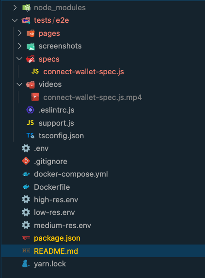
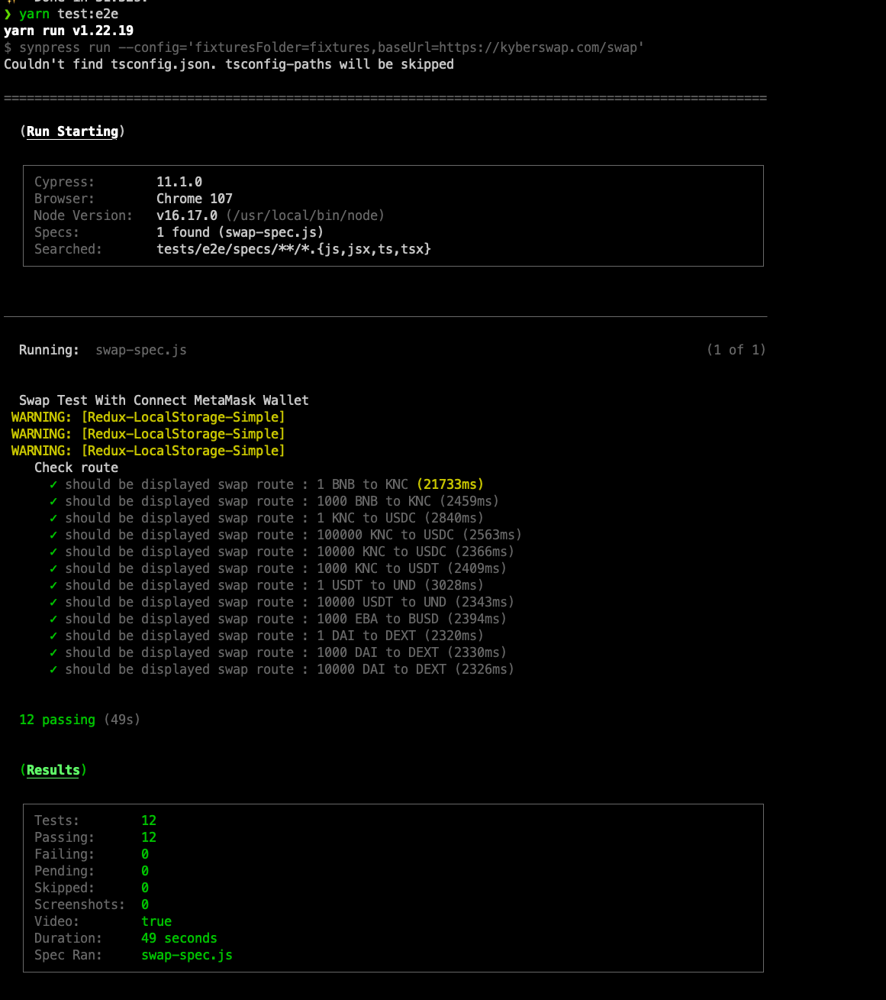

# Run E2E Testing and Components Testing with metamask

1. Clone pull [this repository](https://github.com/KyberNetwork/synpress.git)
2. `yarn install`
3. `yarn test:e2e:local`

## Configuration

### 1. Config metaMask network in [.env](.env) file like

```env
NETWORK_NAME=Binance Smart Chain Mainnet
RPC_URL=https://bsc-dataseed1.binance.org
CHAIN_ID=56
SYMBOL=BNB
BLOCK_EXPLORER=https://bscscan.com
IS_TESTNET=
PRIVATE_KEY=
```

### 2.Structure




## How to run

```sh
yarn test:e2e
```


## Report
[](./docs/swap-spec.js.mp4)
